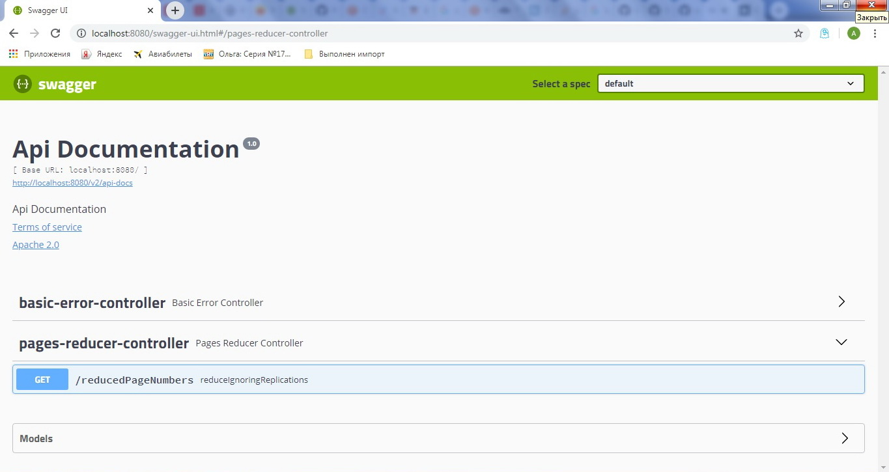

# PagesNumbersReducer
Application that assist user with getting reduced form for arbitrary set of page numbers that user would like to print.
## Built With
* 	[Maven](https://maven.apache.org/) - Dependency Management
* 	[OpenJDK](http://jdk.java.net/archive/) - Java™ Platform, Standard Edition Development Kit 
* 	[Spring Boot](https://spring.io/projects/spring-boot) - Framework to ease the bootstrapping and development of new Spring Applications
* 	[Swagger](https://swagger.io/) - Open-Source software framework backed by a large ecosystem of tools that helps developers design, build, document, and consume RESTful Web services.
## Running the application locally
There are several ways to run a Spring Boot application on your local machine. One way is to execute the `main` method in the `home.MyBootApplication` class from your IDE.
Alternatively you can use the [Spring Boot Maven plugin](https://docs.spring.io/spring-boot/docs/current/reference/html/build-tool-plugins-maven-plugin.html) like so:

```shell
mvn spring-boot:run
```
## Endpoints

|Method | 	Url		| 	Description |
|-------| ------- | ----------- |
|GET|/v2/api-docs| 	swagger json|
|GET|/swagger-ui.html| 	swagger html|
|GET|/reducedPageNumbers?rawPageNumbers=| 	get reduced set numbers|


Screenshot


